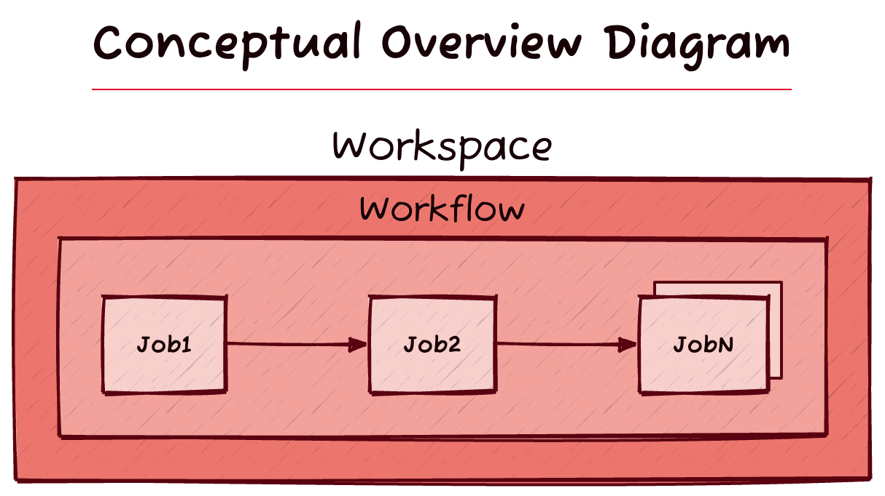
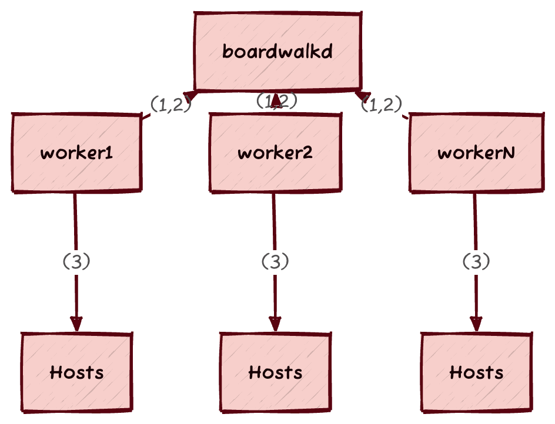

Boardwalk
=========
<div id="boardwalk-readme-icon">

</div>

Boardwalk is an open-source linear [Ansible](https://www.ansible.com/) workflow engine. It's
purpose-built to help systems engineers automate low-and-slow background jobs
against large numbers of production hosts. It's ideal for rolling-maintenance
jobs like kernel and operating system upgrades.

Boardwalk makes it easy to define workflows composed of a series of jobs to
perform tasks on hosts using Ansible. It connects to hosts one-at-a-time running
jobs in a defined order and maintaining a local state as it goes; this makes
stopping and resuming long-running Ansible workflows easy and efficient.

[Read the Boardwalk announcement at the Backblaze blog](https://www.backblaze.com/blog/backblaze-open-sources-boardwalk-workflow-engine-for-ansible/).

💥 __Boardwalk is alpha software. Interfaces and behaviors may change between
updates.__ 💥


<!-- README.md-Table-of-Contents_Before -->
# Table of Contents
- [Motivation & Goals](#motivation--goals)
- [Open-Source License](#open-source-license)
- [Contributing](#contributing)
- [Concepts](#concepts)
    - [Workspace](#workspace)
    - [Workflow](#workflow)
    - [Jobs](#jobs)
    - [Local State](#local-state)
    - [Remote State](#remote-state)
- [Usage](#usage)
    - [Installation](#installation)
    - [The `Boardwalkfile.py`](#the-boardwalkfilepy)
- [Command-line Interface](#environment-variables)
- [`boardwalkd` Server](#boardwalkd-server)

<!-- README.md-Table-of-Contents_After -->

# Motivation & Goals

Ansible is already a very capable agentless, modular, remote execution engine.
It uses task playbooks that are easy to read and run against any number of
hosts, in parallel or in serial. However, Ansible is connection-oriented: most
operations are performed on remote hosts. Ansible connects to a host, copies
code over, and executes it. There's no practical interface to perform
calculations about a host before the host is contacted. This makes long-running
background jobs difficult to work with using Ansible alone. For example, if a
playbook is running for days or weeks and fails, Ansible doesn't retain any
knowledge of where it left off, and can't make any offline calculations about
which hosts it needs to finish up with. When the playbook is re-run, Ansible
will attempt to connect to all the hosts it had previously connected to,
potentially resulting in a long recovery time for a failed job. And this makes
sense: __Ansible is primarily a remote execution engine, and not a workflow
engine__. A workflow engine wrapping Ansible can do calculations and state
management beyond what Ansible is designed for.

Boardwalk is implemented as a workflow engine to run jobs that wrap Ansible
tasks. It's specifically aimed towards long-running, low-and-slow, rolling
Ansible workflows. It interfaces with Ansible via
[ansible-runner](https://github.com/ansible/ansible-runner), which is the same
interface used by [AWX](https://github.com/ansible/awx).

## Non-Goals

- ⛔️ Be a scheduler. Boardwalk doesn't need to solve the problems that cron,
  systemd timers or other schedulers do. Boardwalk does have primitives for
  locking/mutexes to prevent overlapping operations, however.
- ⛔️ Reproduce features of Ansible. As much as possible, Boardwalk should not
  reproduce core features of Ansible. Boardwalk doesn't need its own modular
  task execution system because it can interface with Ansible for that.
  Boardwalk shouldn't create its own inventory system, nor should it create its
  own secret management system, because Ansible already has solutions to those
  areas.

# Installation
<!-- README.md_Installation_Section_Before -->

We recommend installing `boardwalk` in a [`pipx`](https://pipx.pypa.io/stable/)
environment, to ensure that your system or user pip packages are not affected by
Boardwalk's dependencies. Refer to `pipx`'s documentation for how to install it,
and then execute the following commands:
```sh
# Boardwalk depends on `ansible` in order to run.
pipx install ansible>=6.5.0
# Inject Boardwalk into the environment so it can use Ansible. Optionally,
# appending an @<git reference> allows for installing specific commits,
# branches, or tags.
pipx inject ansible git+ssh://git@github.com/Backblaze/boardwalk.git
```

__Note__:
Boardwalk should be designed to be compatible with the current stable Python3
release, minus 1 minor version. So, if the current stable version is `3.22.x`,
Boardwalk should work with `3.21.x`. Consider using
[`pyenv`](https://github.com/pyenv/pyenv) to maintain fresh python environment.

## Shell Completion

To enable shell completion for `boardwalk` and `boardwalkd`, the following set
of commands will generate the completion script and add them to your shell (a
shell restart will be needed):

### Bash
```bash
_BOARDWALK_COMPLETE=bash_source boardwalk > ~/.boardwalk-complete.bash
_BOARDWALKD_COMPLETE=bash_source boardwalkd > ~/.boardwalkd-complete.bash
echo '. ~/.boardwalk-complete.bash' >> ~/.bashrc
echo '. ~/.boardwalkd-complete.bash' >> ~/.bashrc
```

### Zsh
```zsh
_BOARDWALK_COMPLETE=zsh_source boardwalk > ~/.boardwalk-complete.zsh
_BOARDWALKD_COMPLETE=zsh_source boardwalkd > ~/.boardwalkd-complete.zsh
echo '. ~/.boardwalk-complete.zsh' >> ~/.zshrc
echo '. ~/.boardwalkd-complete.zsh' >> ~/.zshrc
```

### Fish
```sh
_BOARDWALK_COMPLETE=fish_source boardwalk > ~/.config/fish/completions/boardwalk.fish
_BOARDWALKD_COMPLETE=fish_source boardwalkd > ~/.config/fish/completions/boardwalkd.fish
```

## Container Install

Boardwalk may be built as a container image by running `make container`.

The entrypoint is simply `python -m` so either `boardwalk` or `boardwalkd`
must be specified as the command when running.
<!-- README.md_Installation_Section_After -->

# Open-Source License

Boardwalk is open source, licensed under the terms of the [MIT license](https://github.com/Backblaze/boardwalk/blob/main/LICENSE).

# Contributing

See [CONTRIBUTING.md](https://github.com/Backblaze/boardwalk/blob/main/CONTRIBUTING.md).

# Concepts



## Workspace

Workspaces define isolated configurations and state for working on projects with
Boardwalk. They define the Ansible host pattern Boardwalk should target, the
Workflow Boardwalk will use, and some essential configuration options.

Workspaces are defined in the [Boardwalkfile.py](#the-boardwalkfilepy). The
active Workspace is selected with `boardwalk workspace use <workspace name>`.

## Workflow

Every Workspace specifies a Workflow. Workflows are the set of Jobs that will be
run against hosts in the Workspace. They define the Jobs, Jobs options, and the
order in which Jobs are run. Jobs are run in series, one after another. The
purpose of a Workflow is to mutate a host from one state to another. Typically
Workflows depend upon some Ansible fact(s) having changed after the Workflow has
completed all of its Jobs.

Workflows are defined in the [Boardwalkfile.py](#the-boardwalkfilepy).
Workflows can be dry-run with `boardwalk check`, which runs Ansible in `--check`
mode. Workflows are run with `boardwalk run`.

## Jobs

Jobs define what is actually executed in a Workflow. They define Ansible tasks
that are run against hosts. They accept options that can be passed into them and
used in tasks. They define preconditions that a host must meet before a Workflow
will run against it.

Jobs are defined in the [Boardwalkfile.py](#the-boardwalkfilepy).

### Job Preconditions

Preconditions are an important feature of Boardwalk Jobs; they are the mechanism
indicating to Boardwalk whether a Workflow needs to be run on a host. When used
effectively, __Preconditions are the feature that allows Boardwalk to skip hosts
that it does not need to act upon or has already acted upon and completed.__

Preconditions are simply a Python boolean expression that return True or False.
Generally the preconditions are based upon Ansible facts and vars, but they may
consider anything that the execution environment has access to. Workflows
consider the preconditions of _all_ Jobs in the Workflow. If _any_ Job
preconditions are not True, the host the Workflow is acting upon will be skipped
unless the workflow had already started but never completed.

Both facts and variables from the inventory may be used in preconditions. Facts
must be gathered from hosts using `boardwalk init`, but inventory vars are
processed at runtime when `boardwalk check` or `boardwalk run` is used.
Inventory vars may contain [Jinja](https://jinja.palletsprojects.com/)
expressions, and Boardwalk does not process them.

Boardwalk will ignore preconditions for hosts where a Workflow was started but
never finished. Boardwalk automatically assumes the host did originally meet
preconditions but still needs the Workflow to complete. This behavior merits
some important considerations. If a host has started a Workflow, but never
finished, preconditions are ignored even if the preconditions or Workflow Jobs
have changed. Thus, it's very important not to rely on preconditions alone for
safety. Additional safety checks should be included in the Ansible tasks run by
Jobs.

## Local State

Boardwalk maintains a local "statefile" for each Workspace. The primary data
contained in the local state are Ansible facts associated with hosts. Inventory
vars are not stored in the statefile because they are processed at runtime.

The state is initially built using `boardwalk init`, and Workflows update the
state with fresh Ansible facts as hosts are completed. The local state can be
reset with `boardwalk workspace reset`.

## Remote State

Boardwalk maintains a remote statefile on each host in
`/etc/ansible/facts.d/boardwalk_state`. This file is used internally by
Boardwalk.

# Usage

(the-boardwalkfilepy)=
## The `Boardwalkfile.py`

Boardwalk is both a python library and command-line tool. The `boardwalk`
command-line tool expects a file called `Boardwalkfile.py` to exist in the
current working directory where it's run. The `Boardwalkfile.py` defines what
Workspaces, Workflows, and Jobs are available for use and how they are used.

### Example `Boardwalkfile.py`

```python
"""
In this example, we define a Workspace, Workflow, and Jobs for performing
OS upgrades for storage pods in the staging environment
"""

# Imports the boardwalk module and classes used in the Boardwalkfile.py
from boardwalk import TaskJob, Workflow, WorkflowConfig, Workspace, WorkspaceConfig, path

# Optionally sets the URL to a boardwalkd server
boardwalkd_url = "http://localhost:8888"

# Defines a Workspace with the name "StagingPodDistUpgrades"
class StagingPodDistUpgrades(Workspace):
    """
    Workspaces have a required "config" method that returns a WorkspaceConfig
    object. The WorkspaceConfig defines essential options. Some options have
    defaults. Currently, the best way to see what options are available, which
    are required, and what details are set to is to use a Python IDE
    """
    def config(self):
        return WorkspaceConfig(
            # Required. Defines the Ansible host pattern
            host_pattern="staging:&pod",
            # Required. Defines the Workflow to use
            workflow=PodDistUpgradeWorkflow(),
            # Optional. Defines the default ordering Boardwalk will use to walk
            # through hosts, based upon hostname. See `boardwalk run --help` for
            # available options
            default_sort_order="shuffle"
        )


# Defines a Workflow with the name "PodDistUpgradeWorkflow", referenced by the
# StagingPodDistUpgrades Workspace
class PodDistUpgradeWorkflow(Workflow):
    """
    Workflows have a required "jobs" method that returns a tuple of Jobs. Jobs
    in the Workflow are executed in the order defined here. This is where
    options are provided to Jobs (if any)

    There is also an optional exit_jobs method, which is the same as this method
    except that the Jobs returned by exit_jobs are run after regular Jobs, and
    they are always attempted, even upon failure
    """
    def jobs(self):
        return (
            PodPreTasksJob(),
            DistUpgradeJob(options={"target_version": 10}),
            PodPostTasksJob(),
        )

    """
    Optional workflow configuration options may be specified. The example below
    changes Boardwalk's default behavior. Normally, Boardwalk will always retry
    workflows on failed hosts until they complete the workflow successfully at
    least once, even if they no longer meet Job preconditions. This example
    disables this behavior
    """
    def config(self):
        return WorkflowConfig(always_retry_failed_hosts=False)


# Defines a TaskJob with the name "PodPreTasksJob", which is called in the
# PodDistUpgradeWorkflow Workflow as the first Job
class PodPreTasksJob(TaskJob):
    """
    Jobs have an optional "tasks" method that returns a list of Ansible tasks.
    The format for tasks is structurally the same as Ansible tasks defined using
    YAML, but they must be formatted as a list of Python dictionaries as shown

    The path() function used here as an example is an important helper for cases
    where local paths are reference on the controller running Boardwalk. The
    underlying interface Boardwalk uses for Ansible dynamically renders a
    playbook to a temporary file outside of the working directory. The path()
    function translates relative paths to absolute paths so the generated
    playbook is able to locate referenced file paths
    """
    def tasks(self):
        return [{"import_tasks": path("dist_upgrade/pod_pre_tasks.yml")}]

# Defines a TaskJob with the name "DistUpgradeJob", which is called in the
# PodDistUpgradeWorkflow Workflow as the second Job
class DistUpgradeJob(TaskJob):
    """
    Jobs have an optional "required_options" method that returns either a string
    or tuple of strings. The return value specifies options that can be passed
    into the Job class, via the "options" argument, as a dict. Options being
    passed into this Job can be seen in the PodDistUpgradeWorkflow class above.
    Options specified here will be required, and an exception will be raised
    if they are missing when called by a Workflow
    """
    def required_options(self):
        return "target_version"  # This is the major Debian version to upgrade to

    """
    Jobs also have an optional "preconditions" method that returns either True
    or False. The purpose of this method is to determine whether or not a Job
    should be run on a given host. Ansible facts and vars for the hosts a Job
    will work on are passed into this method so they can be considered. Notice
    the usage of facts, inventory_vars, and options here

    In this example the expression says "If the linux distribution is Debian and
    the Debian version is less than the target_version, and there is no
    do_not_upgrade variable set by the inventory, then return True, else
    return False"

    Note that preconditions can exist for a Job without any tasks. This may be
    useful for cases where a Workflow should have additional preconditions

    By default, preconditions are ignored if a workflow has started on a host
    but never completed. This behavior may be changed as described in the
    Workflow class above
    """
    def preconditions(self, facts: dict, inventory_vars: dict):
        return (facts["ansible_distribution"] == "Debian")
            and (int(facts["ansible_distribution_major_version"]) < int(self.options["target_version"]))
            and not "do_not_upgrade" in inventory_vars

    """
    This example of the tasks method shows a way of passing an option from the
    Job class into the underlying Ansible tasks by using set_fact
    """
    def tasks(self):
        return [
            {"set_fact": {"target_debian_version": self.options["target_version"]}},
            {"import_tasks": path("dist_upgrade/main.yml")},
        ]

# Defines a TaskJob with the name "PodPostTasksJob", which is called in the
# PodDistUpgradeWorkflow Workflow as the last Job
class PodPostTasksJob(TaskJob):
    def tasks(self):
        return [
            {"import_tasks": path("dist_upgrade/pod_post_tasks.yml")}
        ]
```

## Command-line Interface

Once you have a `Boardwalkfile.py`, `boardwalk` can be used to run workflows. The
example command-line usage below is using the `Boardwalkfile.py` example above.
Not all subcommands and options are listed here. Explore `boardwalk --help` for
more.

```sh
# In the same directory as the Boardwalkfile.py...
# List workspaces to see what's available:
boardwalk workspace list

# Select the available workspace:
boardwalk workspace use StagingPodDistUpgrades

# Initialize the local state. This will run Ansible fact gathering against
# all of the hosts matching the host_pattern configured for the workspace:
boardwalk init

# Check that the workflow is working as expected. This checks Job preconditions
# and runs the Ansible tasks defined in Jobs in --check mode:
boardwalk check

# If everything looks good, run the workflow:
boardwalk run

# In another terminal (in the same directory) you can catch execution _locally_
# if needed. This will pause the execution of the workflow before starting the
# next host:
boardwalk catch

# ... and this will resume the workflow if it has been _locally_ caught:
boardwalk release

# boardwalk also has command-line help:
boardwalk --help

# boardwalk's subcommands also have help. For example:
boardwalk workspace --help
```

## Environment Variables

- `BOARDWALK_WORKSPACE`: When set, Boardwalk will use the value as the Workspace
  in use. This allows the tool to run against multiple Workspaces at the same
  time from the same working directory.

## Ansible Configuration & Options

Ansible, when run inside Boardwalk, will use almost the exact same configuration
as any Ansible commands will use outside of Boardwalk. The only differences are:

- Boardwalk will force using its own fact cache
- `boardwalk init` will timeout hosts after 5 minutes

Boardwalk doesn't support all the command-line flags for `ansible-playbook`,
such as the `-i` option and others. Ansible options must be configured via [an
ansible.cfg](https://docs.ansible.com/ansible/latest/reference_appendices/config.html)
and/or [environment
variables](https://docs.ansible.com/ansible/latest/reference_appendices/config.html).

### Ansible Fact Cache

Boardwalk maintains a fact cache per-workspace. The fact cache is populated for
all hosts in a workspace during `boardwalk init`, and for each individual host
as a Workflow runs. If `boardwalk init` hasn't been run in a long time, it may
have stale data about hosts in the workspace.

### Ansible Performance

Some optimal configuration settings are recommended. Ansible settings below are
shown as environment variables here, but they may also be provided in an
`ansible.cfg` or via other usual means:

Boardwalk frequently connects and disconnects from hosts during normal
operation. In order to reduce the overhead of this behavior, it's a good idea to
enable persistent connections, which temporarily keeps a control socket open to
remote hosts:

```sh
export ANSIBLE_USE_PERSISTENT_CONNECTIONS=True
export ANSIBLE_PERSISTENT_CONNECT_TIMEOUT=60 # Or higher...
```

`boardwalk init`, connects to all hosts matching the active Workspace's host
pattern to gather facts. Speeding up `init` requires the same kind of
optimizations that would normally be expected for running Ansible playbooks
against large numbers of hosts: `ANSIBLE_FORKS` should be set to as high a value
as the controller can handle. Maximizing `ANSIBLE_FORKS` depends upon the
controller's CPU, memory, and open files limits.

## Automatic Vars

Boardwalk injects a boolean variable into Ansible operations,
`boardwalk_operation`. This variable is always `True` when Ansible is being run
by Boardwalk.

## `boardwalkd` Server

Boardwalk is bundled along with `boardwalkd`, which is a central network server
that Boardwalk can coordinate with. By specifying `boardwalkd_url` in the
`Boardwalkfile.py`, `boardwalk` instances become referred to as "workers".
Boardwalk will use the server for several purposes: It enables Boardwalk to:
- Ensure Workspaces are only running in one place, by "locking" Workspaces on
  the server.
- Allows operators to catch/release Workflows from a UI.
- Displays Workspaces in a UI with status updates and worker details.
- Allows posting status updates to a Slack webhook.

See `boardwalkd serve --help` for options to run the server.

### Architecture

In the diagram and descriptions below, the word "worker" refers to the
`boardwalk` CLI when it is connected to `boardwalkd`.



> Key
> ---
> (1) Worker details, Workspace data, Workflow events,
heartbeats sent from workers to boardwalkd over HTTP(S).
>
> (2) Workers poll boardwalkd over HTTP(S) for semaphores including Workspace
mutexes and Workspace catches.
>
> (3) Workers connect directly to hosts over SSH.

### Catch & Release Behavior With Boardwalkd

When Boardwalk encounters an error on a host, it will automatically catch the
workspace. When a `boardwalkd` server is configured, automatic catching of
Workspaces will occur on the remote server rather than locally. It's still
possible to perform a local catch/release even when connected to `boardwalkd`,
and local catches cannot be released from the server UI. If Boardwalk encounters
an error and for any reason it cannot catch the Workspace on the server, it will
fall back to catching locally.

### Boardwalkd Database Storage and Persistence
`boardwalkd` uses a single JSON file to save state. The JSON file is flushed to
the working directory of the server, in `.boardwalkd/statefile.json`

### Security

__Authentication__: By default, `boardwalkd` uses anonymous authentication. It's
important that an authentication method be configured. See
`boardwalkd serve --help` for available options.

__TLS__: `boardwalkd` supports TLS termination. See `boardwalkd serve --help`

__No access to hosts__: `boardwalkd` is not involved in managing hosts; only
CLI workers require direct access to hosts.

__Limited control of workers__: CLI workers poll `boardwalkd` for Workspace
mutexes and catches to determine if operations may proceed or should halt. This
is the full extent of control `boardwalkd` has over worker behavior.

__Limited information disclosure from workers__: CLI workers emit limited
details about the worker and workflow events to `boardwalkd`. When workers
encounter an Ansible task error, the failed task's name and module name are sent
to `boardwalkd` as part of an event, but do not contain the full error output.
